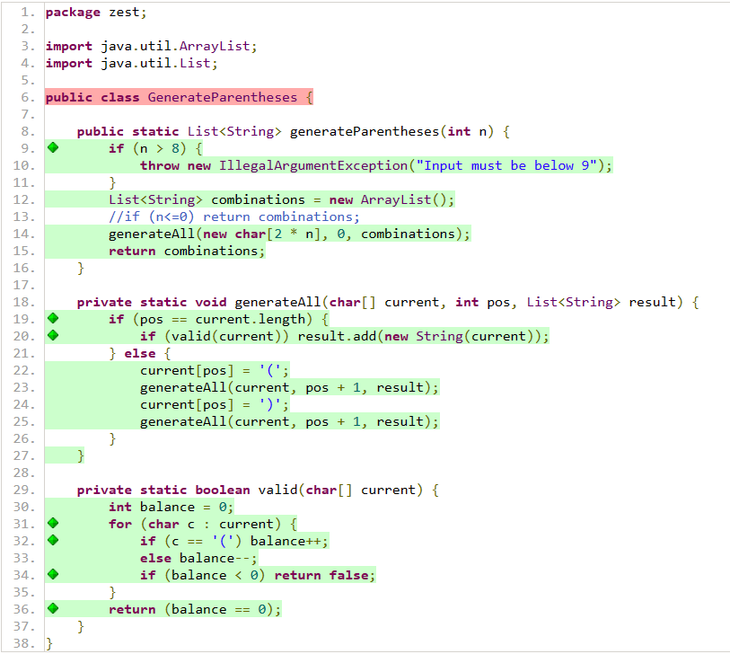

# GenerateParentheses

### Specification testing

#### 1. Understanding the requirements
The general idea of the class is easy understandable. The method should generate all combinations of well-formed parentheses. And the only input is the amount of parentheses.
#### 2. Exploring the program 
Like this I looked at all the possible outputs the program should be able to produce:

    @Test
    void testRun() {
        for (int i = 1; i <= 8; i++) {
            List<String> result = GenerateParentheses.generateParentheses(i);
            System.out.println("n = " + i + ", size: " +  result.size() + ": " + result);
        }
    }

#### 3. Analyze properties of inputs and outputs and find partitions
There are not many partitions to identify in this step. There is only a single input. Therefore, there are also no variable Interactions. And the individual range of n is as stated: 1 <= n <= 8. 

#### 4. Analyze the boundaries
The boundaries of the parameter are 1 and 8. However i dont think that focusing on the boundaires is super important in this case as size is very straight forward and eight is alread very long and complicated. I think it makes more sense to identifying a pattern and see if the outputs are complete 
#### 5. Devise test cases
One test i have though of was to test for null. However the method already expects an int so therefore this can be skipped.
#### 6. Implement the automated test cases
I implemented test cases that check if the the output for n=1, 2 or 3 is correct. Also i check for numbers above 9.
Because of the assertThrows for numbers above 8 i added this snipped in the code which throws an error

    if (n > 8) {
        throw new IllegalArgumentException("Input must be below 9");
    }

#### 7. Use creativity and experience to enhance the test suite
After doing some research I found out that the amount of possible combinations should always be equal to the n-th Catalan number of the input.
Therefore I created a helper function to calculate the catalan number.
In a second step i create a test suite that runs throug inputs 1-8 and then checks if the size is equal to the calculated catalan number.
### Structural testing
THe only line which is not covered is the first line which should not be a problem as it is the class initialization 

Becuase all important lines were covered i did not have to add any new tests
### Mutation testing
All mutant were killed by my tests

>> Line Coverage: 18/19 (95%)
>> Generated 19 mutations Killed 19 (100%)
>> Mutations with no coverage 0. Test strength 100%
>> Ran 23 tests (1.21 tests per mutation)

## ChatGPT prompts
-What is the catalan number and how do I calculate it?
-Various Prompts were used to be able to install jacoco and pitest correctly

