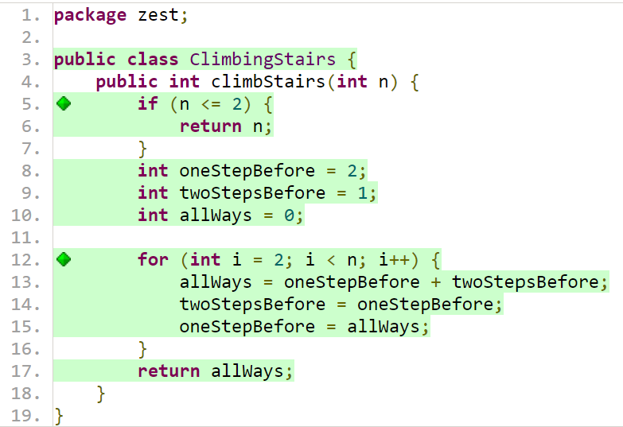
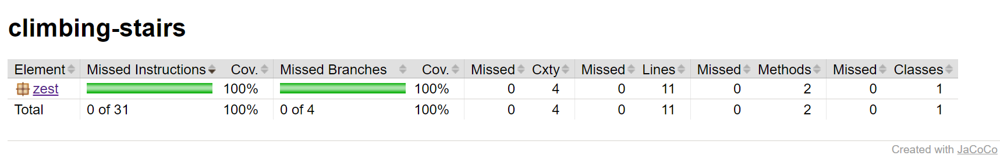
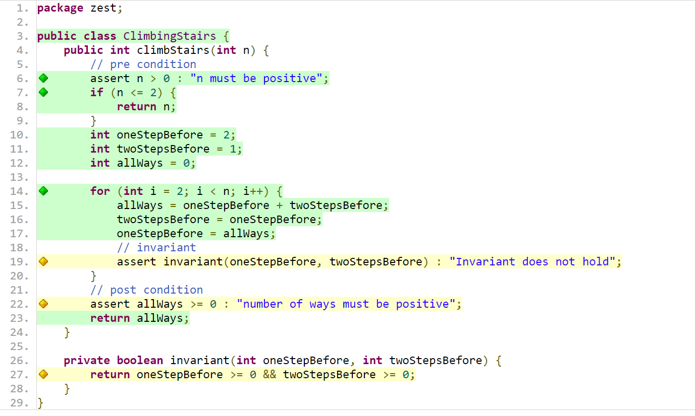
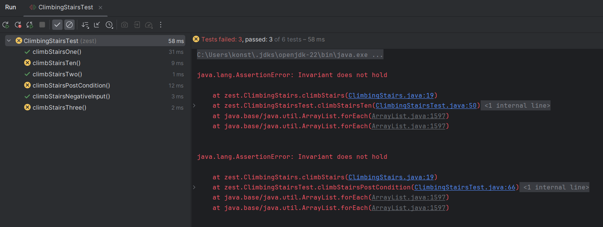

# ClimbingStairs

### Specifications
The general idea is straight forward. How many distinct ways can you get to the top if you always either take one or two steps.

To get a better understanding I ran testRun() which prints:

n = 1,result: 1
n = 2,result: 2
n = 3,result: 3
n = 4,result: 5
n = 5,result: 8
n = 6,result: 13
n = 7,result: 21
n = 8,result: 34

From this output I realized that this is actually the fibonacci sequence.

Input:
n (type: positive integer)
Constraints: n >= 1

Output:
Count of ways (type: non-negative integer)

Partitions:
Small values where n is 1 or 2.
Larger values where dynamic calculation is necessary (e.g., n = 3 or higher).

I found it weird and unessecary that long is used and changed the output type from long to int.

Then I created four test cases for n= 1, 2, 3 and 10
### Task 1: Code Coverage

I reran the mvn test command after adding the Contracts which then are not covered in the line coverage
However this is not a problem as these are only the post condition and invariant and all relevant lines are covered

### Task 2: Designing Contracts
The method already enforces an int input. Therefore, the contracts i could think of are: \
-Precondition: n must be a positive integer
-Postcondition: The final calculated number of ways (allWays) must be non-negative \
-Invariant: The values of oneStepBefore and twoStepsBefore should be non-negative integers \
### Task 3: Testing Contracts
The "climbStairsNegativeInput" confirms that the correct assertion error is thrown when the input is negative \
The "climbStairsPostCondition" ensures post-conditions hold after the execution of the function under various conditions \
To verify that the invariants are maintained I changed "oneStepBefore >= 0" to "oneStepBefore == 0" which should result in an assertion error which it does:

### Task 4: Property-Based Testing
Because I realized in an earlier step that the sequential output of the ClimbingStairs actually is equal to the fibonacci sequence I made use of that for property based testing.
So the property is that if the input n is 1 or 2 the output will be 1 or 2 respectively. And if the input is above 2 the Property Based test checks if the property of
the fibonacci sequence holds, which means  it checks for all numbers if its equal to the sum of the output of n-1 and n-2.

## ChatGPT prompts
-Why do I get the following error message?: 
"java: incompatible types: inference variable T has incompatible bounds
equality constraints: java.lang.AssertionError
upper bounds: java.lang.Exception,java.lang.Throwable"\
-How do I add jqwik to a pom.xml file?
