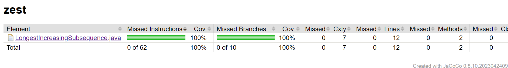
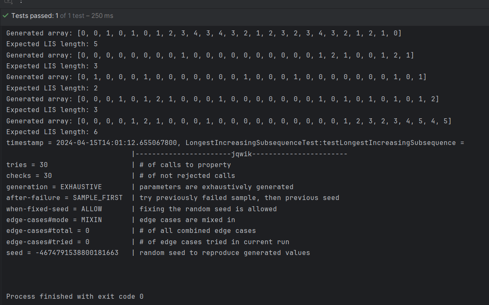

# LongestIncreasingSubsequence

### Specifications
Problem: Find the length of the longest subsequence of a given sequence of numbers that is strictly increasing. Some elements may be deleted

Input: an array of integers, nums, which may include duplicates and any integer (positive, negative, zero).\
Output: a non-negative integer that represents the length of the longest strictly increasing subsequence.

Input Properties:\
Arrays with different sizes \
empty array \
Arrays where all elements are the same (LIS == 1)\
Arrays already sorted in increasing order (len array == LIS)\
Arrays with negative numbers, zeros, and positive numbers mixed

Output Properties:\
Always a non-negative integer.\
1 if all elements are the same or only one element to the length of the array if strictly increasing 

Input Partitions:\
Empty array.\
Array with one element.\
Array with all elements the same.\
Array sorted in increasing order.\
Array sorted in decreasing order.\
Array with random order.\

Not sure if this was on purpose but the File was called "LongestIncreasingSubsequence .java" and the space before the dot caused an error 
which I fixed by removing the space.
### Task 1: Code Coverage
After running mvn test I saw that achieved 90% coverage because I did not writhe a test case for "null". 
I added "testNull()" and reran the plugin to get 100% coverage.

### Task 2: Designing Contracts
The method already enforces an int input. Therefore, the contracts I came up with are: \
-Precondition: nums should be not null and the elements should be int (integer is enforced by the method)
For this i added an assertion and then commented out the check for null:\
assert nums != null : "Input cannot be null";\
if (/* nums == null || */ nums.length == 0) { \
-Postcondition: the output has to be non-negative \
assert maxLength >= 0 : "Output has to be non-negative"; \
-Invariant: maxLength should never decrease during execution\
int oldMaxLength = maxLength;\
maxLength = Math.max(maxLength, dp[i]);\
assert maxLength >= oldMaxLength : "maxLength should not decrease";
### Task 3: Testing Contracts
"testNull" confirms that the correct assertion error is thrown when the input is null\
I had to change the test that it now checks for an assertion error and not 0 anymore.\
The old test is commented out \
The different tests like testMixedOrder and testAlreadySorted ensures post-conditions hold after the execution of the function under various conditions \
To verify that the invariants are maintained I changed "maxLength >= oldMaxLength" to "maxLength <= oldMaxLength" which should result in an assertion error which it does:

### Task 4: Property-Based Testing
I tried a similar approach as in the book on page 128 where numbers are added to an array and the loop keeps track of the expected output.
My property test creates 30 lists with lengths from 1 to 30.
The loop keeps adding new number to the end of the list. Its either the same number, a higher number of a lower number. If the number added is a higher number than the "lastInLIS" the counter is incremented.
The property test passes:

All tests passing:

## ChatGPT prompts
-I was not sure about the Invariant for this method. I only came up with the idea that maxLenght also always have to be non-negative just like the post condition.
Therefore I asked ChatGPT for help to look for an invariant: "What are the invariants of this method?"\
-How do I add jqwik to a pom.xml file?
