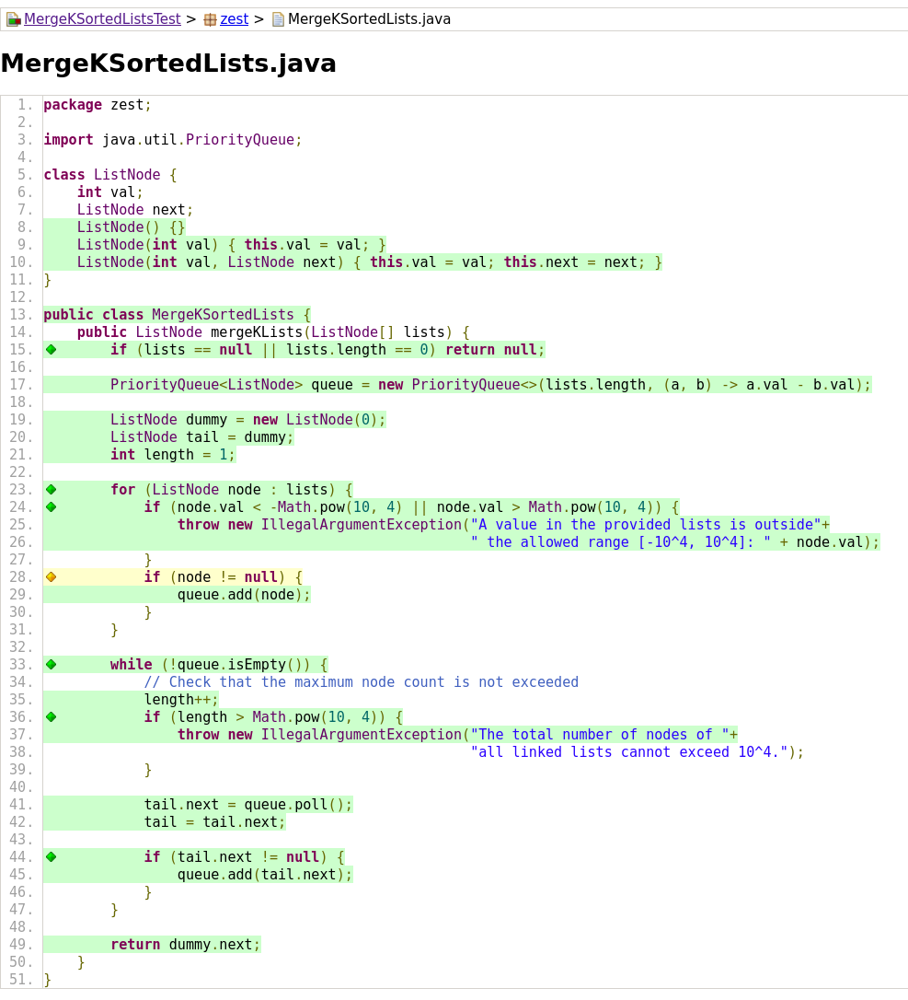

# Testing documentation - MergeKSortedLists

## Specification testing

### Understanding the requirements

Given a list of **sorted** linked lists containing integers in range [-10^4, 10^4], return a single sorted linked list. The total number of nodes of all linked lists cannot exceed 10^4.

### Analyze properties of inputs and outputs and find partitions

Single input: Array of linked lists, with nodes defined as:

```
class ListNode {
    int val;
    ListNode next;
    ListNode() {}
    ListNode(int val) { this.val = val; }
    ListNode(int val, ListNode next) { this.val = val; this.next = next; }
}
```

| partition | expected output |
| --- | --- |
| empty array | empty array or null |
| null | null |
| # nodes <= 10^4, values $\in [-10^4, 10^4]$ | merged sorted linked list |
| # nodes > 10^4 | exception |
| some value $\notin [-10^4, 10^4]$ | exception |


### Analyze the boundaries

| partition | on-point | off-point |
| --- | --- | --- | 
| # nodes <= 10^4, values $\in [-10^4, 10^4]$ | 10^4 | 10^4 + 1 |
| some value $\notin [-10^4, 10^4]$ | -10^4 - 1 | 10^4 + 1 |


### Devise test cases

No combinations of partitions needed, as there only is one input.

| input | expected output |
|--|--|
| [] | [] |
| null | null |
| [[-1, 2, 3], \[2], \[0]] | [-1, 0, 2, 2, 3] |
| [\[3\] * 10^4+1]] | error |
| [[10^4 + 1]] | error |
| [[-10^4 - 1]] | error |


### Bugs found

1. The program did not check the required constraints. Given a linked list with 10^4+1 nodes, it would return a non-empty merged list.
2. The program also did not check the accepted integer value range ([-10^4, 10^4]).


## Task 1: Code Coverage
<!-- In this task, you are required to achieve the highest possible (ideally, 100\%) line coverage. for the provided Java solutions. Utilize the [JaCoCo] plugin to analyze and generate coverage reports.  -->

With just the specification tests described above, we reached 100% line coverage and 94% branch coverage (not required):



## Task 2: Designing Contracts
<!-- - For the provided Java solutions, design and document contracts including pre-conditions, post-conditions, and invariants.
- Implement the contracts in Java solution code and write tests to verify that the contracts are enforced at runtime. Define appropriate pre-conditions, post-conditions, and invariants for each provided Java solution. Incorporate the designed contracts into the source codes. For invariants, ensure they are checked at the start and end of each public method or after any state-changing operation. -->


From the specifications we can formulate the following contract.

### Pre-conditions

1. The linked lists of the input array must be sorted in ascending order
2. The total number of nodes of the input linked lists must not exceed 10^4
3. The values in the linked lists must be in the range [-10^4, 10^4]

### Post-conditions

1. The output linked list must be sorted in ascending order
2. The output linked list must have the same number of nodes as the input linked lists

### Invariants

We could not think of an invariant. MergeKSortedLists is functional in practice, so there is no state that has to hold some properties before and after calling it. 

We could potentially define the fact that any linked lists (input and output) existing in MergeKSortedLists() must be sorted in ascending order, but since this does not refer to any particular attribute or parameter, we prefered to keep it specific to the input and output, thus in the pre- and post-conditions.


## Task 3: Testing Contracts
<!-- Develop a suite of JUnit tests specifically aimed at verifying that the contracts are correctly enforced. This should include tests that:
- Validate normal operation when pre-conditions are met.
- Confirm that appropriate exceptions or errors are thrown when pre-conditions are violated.
- Ensure post-conditions hold after the execution of functions under various conditions.
- Verify that invariants are maintained throughout the software module's lifecycle, especially after state changes. -->

### Tests for pre-conditions

1. `unSortedInputTest()`: The linked lists of the input array must be sorted in ascending order
2. `nodeCountOverUpperBoundaryTest()`: The total number of nodes of the input linked lists must not exceed 10^4
3. `nodeValueOverUpperBoundaryTest()`, `nodeValueUnderLowerBoundaryTest()`: The values in the linked lists must be in the range [-10^4, 10^4]

### Tests for post-conditions

The valid example in `validInputTest()` tests the post-conditions in one scenario. The property-based testing that follows tests them more thoroughly.


## Task 4: Property-Based Testing
<!-- - Use **property-based testing** techniques to derive tests for the provided Java solutions.
- Identify properties that should hold true for any inputs and document your rationale.
- Use a property-based testing framework to automate the testing process. 
- hint: Add jqwik framework to Your pom.xml -->

The property of MergeKSortedLists could be: If the input adheres to the contract, return a single ascendingly sorted linked list, resulting from a merge of the input linked lists. The property test is implemented using Jqwik in `validInputValidOutputTest()`.

After solving a problem related to our jqwik provider function sometimes behaving erratically (creating an array of the wrong size), the property test itself ran successfully for 1000 iterations without any errors, as documented in the [log](./log.txt).


## LLM prompts

### Q1 

How do I instantiate an array of linked list objects defined as follows, and populate the first list with N times some integer?
```
class ListNode {
    int val;
    ListNode next;
    ListNode() {}
    ListNode(int val) { this.val = val; }
    ListNode(int val, ListNode next) { this.val = val; this.next = next; }
}
```

#### Answer

 To instantiate an array of `ListNode` objects, where each element in the array is the head of a linked list, and then populate the first linked list with \(N\) times some integer \(M\), you can follow these steps in Java. This will involve creating the array and then populating the first list as specified.

Here is a step-by-step guide and the code to accomplish this:

##### Step 1: Create the Array of ListNode

You declare an array of `ListNode` objects. The size of the array depends on how many linked list heads you want to store.

```java
ListNode[] listNodes = new ListNode[10]; // Example: array of 10 linked list heads.
```

##### Step 2: Populate the First List

To populate the first list in the array with \(N\) times some integer \(M\), you can create a loop that generates \(N\) new `ListNode` objects, each initialized with the value \(M\), and link them together.

```java
int N = 5;  // Example: Number of nodes
int M = 3;  // Example: Value to be repeated

// Check if there's at least one list in the array
if (listNodes.length > 0) {
    ListNode head = new ListNode(M); // Create the head node with value M
    ListNode current = head; // Use current to traverse and build the list
    for (int i = 1; i < N; i++) { // Start from 1 because the head is already created
        current.next = new ListNode(M); // Create new node with value M and link it
        current = current.next; // Move to the new node
    }
    listNodes[0] = head; // Assign the populated list as the first element in the array
}
```

##### Explanation:

1. **Array Initialization**: An array of `ListNode` is created. Initially, all entries are `null`.
2. **List Population**: If the length of the array is positive, we initialize the first linked list. The head of the list is created and filled with the value \(M\). A loop runs \(N-1\) more times (since the head is already created) to add \(N-1\) more nodes, each with the value \(M\).
3. **Linking Nodes**: Each new node is linked to the previous node through the `next` pointer.
4. **Storing Head**: The head of the newly created list is stored in the first position of the array.

This setup will create a single linked list with \(N\) nodes, all containing the value \(M\), and store the head of this list in the first slot of an array of `ListNode`. The rest of the array remains filled with `null` unless further populated. This approach is modular and can be expanded to populate more lists in the array in a similar fashion.


### Q2

Explain this structure:
```
class ListNode {
    int val;
    ListNode next;
    ListNode() {}
    ListNode(int val) { this.val = val; }
    ListNode(int val, ListNode next) { this.val = val; this.next = next; }
}
```

#### Answer

The `ListNode` class you provided is a fundamental data structure often used in the context of linked lists in programming. Each instance of `ListNode` represents an individual node in a linked list. Here’s a breakdown of each component and how they collectively form a usable structure for linked lists:

##### Class Structure

1. **Fields:**
   - `int val`: This field stores the integer value of the node. It represents the data held by the node.
   - `ListNode next`: This field is a reference (or pointer) to the next node in the linked list. It links one node to another, forming a chain of nodes.

2. **Constructors:**
   - `ListNode() {}`: This is a default constructor. It initializes a `ListNode` object without setting any initial values. The `val` field will default to `0` (the default value for integers in Java), and `next` will default to `null`, indicating that the node does not point to any subsequent node initially.
   - `ListNode(int val) { this.val = val; }`: This constructor initializes the node with a specified value for `val`. The `next` field is implicitly set to `null`, meaning this node does not yet link to any other node.
   - `ListNode(int val, ListNode next) { this.val = val; this.next = next; }`: This constructor initializes a node with both a value and a reference to the next node. It allows the creation of a new node that is immediately linked to an existing node chain.

##### Usage in Linked Lists

In the context of linked lists, `ListNode` serves as a building block. A linked list is a series of connected nodes where each node contains a piece of data and a reference to the next node in the sequence. Here’s how `ListNode` facilitates this structure:

- **Start of the List**: The beginning of the list is typically marked by a reference to the first `ListNode` (often called the head). If this reference is `null`, the list is considered empty.
- **Adding Elements**: When new elements are added to the list, a new `ListNode` is created with the element as its value, and it is connected to the rest of the list by adjusting the `next` pointers.
- **Traversal**: To access or print out all elements of the list, you start at the head and follow the `next` references from one node to the next until you reach a node where `next` is `null`, which signifies the end of the list.
- **Insertion and Deletion**: These operations involve changing the `next` references in one or more nodes to add or remove elements without disturbing the other elements in the list.

##### Benefits of Using ListNode in Linked Lists

- **Dynamic Size**: Unlike arrays, linked lists can grow and shrink during runtime by simply adding or removing nodes. There’s no need to define an initial size or reallocate space, as is necessary with arrays.
- **Efficient Insertions/Deletions**: Adding or removing nodes from a linked list can be done efficiently, especially at the beginning or within the list, without the need to shift elements as required in sequential data structures like arrays.

This structure, while simple, is powerful for creating flexible and dynamic data structures that can handle varying amounts of data efficiently.


### Q3

can I make an arbitrary integer of size between 1 and another predefined arbitrary integer in jqwik?

#### Answer

Yes, in property-based testing frameworks like jqwik, you can generate an arbitrary integer whose size is constrained between 1 and another arbitrary integer that you've predefined. In jqwik, you can achieve this by using combinators and flat mapping to dynamically create dependencies between arbitraries.

Here’s a step-by-step explanation on how you can set this up:

##### Step 1: Define the Upper Limit Arbitrary
First, you define an arbitrary that represents the upper limit. This arbitrary will produce integers within a predefined range, for example, from 1 to 10000.

##### Step 2: Use `flatMap` to Depend on the Upper Limit
You then use the `flatMap` method on this arbitrary. The `flatMap` function allows you to take the output of one arbitrary and use it to define another arbitrary. This second arbitrary can depend on the value produced by the first.

##### Example Code in jqwik
Here is a simple example of how you might write a jqwik test that uses an arbitrary integer (`maxSize`) to define the upper limit for another arbitrary integer (`dependentSize`):

```java
import net.jqwik.api.*;

class ArbitraryDependencyExample {

    @Property
    boolean dependentArbitraryExample(@ForAll("dependentSizeArbitrary") Integer dependentSize) {
        // The property to test; in this case, simply check the size is within expected bounds
        return dependentSize >= 1;
    }

    @Provide
    Arbitrary<Integer> dependentSizeArbitrary() {
        // Define the upper limit as an arbitrary between 1 and 10000
        Arbitrary<Integer> maxSize = Arbitraries.integers().between(1, 10000);

        // Define a dependent arbitrary that relies on the upper limit
        return maxSize.flatMap(upperLimit ->
            Arbitraries.integers().between(1, upperLimit)
        );
    }
}
```

##### Explanation
1. **Max Size Arbitrary**: The `maxSize` arbitrary generates integers between 1 and 10000.
2. **Dependent Arbitrary**: The `dependentSizeArbitrary` uses `maxSize` and the `flatMap` method to create a new arbitrary. This new arbitrary, `dependentSize`, is constrained to be between 1 and the integer generated by `maxSize`.

3. **Testing the Property**: The `dependentArbitraryExample` method receives an integer from `dependentSizeArbitrary` and checks that it is indeed ≥ 1. The real utility of such a setup would be in a more complex test scenario where the size of the integer impacts the behavior of the system being tested.

This setup ensures that the value of `dependentSize` always respects the dynamically generated constraint imposed by `maxSize`, allowing for flexible and powerful test case generation that can cover a wide range of scenarios in property-based testing. This approach is particularly useful when you need to test functions or methods where inputs have dependent relationships.