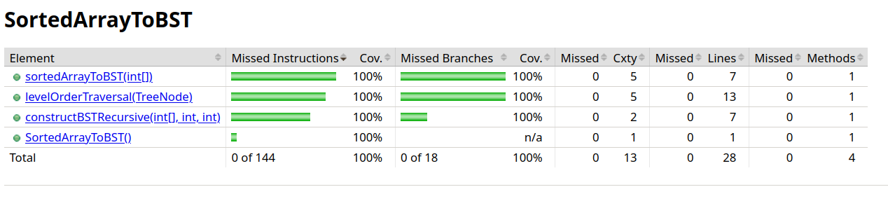

# Testing documentation - SortedArray2BST

## Specification testing

### Understanding the requirements

- Input: Array of unique integers, sorted ascending, length <= 10^4, non-null
- Output: Weight-balanced binary tree


### Analyze properties of inputs and outputs and find partitions

| partition | expected output |
| --- | --- |
| null | exception |
| unsorted array | exception |
| empty array | empty BST/array |
| array of length = 1 | BST/array with one element |
| sorted array of length > 10^4 | exception |
| sorted array of length btw. 0 and 10^4 | BST |

### Analyze the boundaries

| partition | on-point | off-point(s) |
| --- | --- | --- | 
| sorted array of length btw. 0 and 10^4 (valid array) | 10^4 | 10^4 + 1 |

### Devise test cases

No combinations of partitions needed, as there only is one input.

| input | expected output |
|--|--|
| `null` | exception |
| `[0, 2, 1, 3]` | exception |
| `[]` | `[]` |
| `[42]` | `[42]` |
| `[1, 2, ..., 10^4+1]`| exception |
| `[1, 2, ..., 10^4]` | *correct BST* |


### Bugs found

- Passing null did not throw an exception
- Passing an unsorted array did not throw an exception
- Passing an array longer than 10^4 did not throw an exception

## Task 1: Code Coverage
<!-- In this task, you are required to achieve the highest possible (ideally, 100\%) line coverage. for the provided Java solutions. Utilize the [JaCoCo] plugin to analyze and generate coverage reports.  -->
With the above test cases, we reached a line coverage of 100%:




## Task 2: Designing Contracts
<!-- - For the provided Java solutions, design and document contracts including pre-conditions, post-conditions, and invariants.
- Implement the contracts in Java solution code and write tests to verify that the contracts are enforced at runtime. Define appropriate pre-conditions, post-conditions, and invariants for each provided Java solution. Incorporate the designed contracts into the source codes. For invariants, ensure they are checked at the start and end of each public method or after any state-changing operation. -->

All the code for the following contracts is implemented in the public entry point `SortedArrayToBST.sortedArrayToBST()`. Two helpers `convertListToArray()` and `doArraysContainSameValues()` (also used in the test suite) have been added to the class to facilitate checking the invariant. `isBSTValid()` has been added to check the post-condition.

### Pre-conditions

The input list must:

- Contain integers (checked by Java's strong typing)
- Be non-null 
- Be sorted
- Have length <= 10^4

### Post-conditions

- The output must be a valid BST

### Invariants

- The input and the output contain the same elements


## Task 3: Testing Contracts
<!-- Develop a suite of JUnit tests specifically aimed at verifying that the contracts are correctly enforced. This should include tests that:
- Validate normal operation when pre-conditions are met.
- Confirm that appropriate exceptions or errors are thrown when pre-conditions are violated.
- Ensure post-conditions hold after the execution of functions under various conditions.
- Verify that invariants are maintained throughout the software module's lifecycle, especially after state changes. -->

### Tests for pre-conditions

- Contain integers: Checked by Java's strong typing
- Be non-null: `SortedArrayToBSTTest.nullTest()`
- Be sorted: `SortedArrayToBSTTest.unsortedTest()`
- Have length <= 10^4: `SortedArrayToBSTTest.tooLargeInputTest()`

### Tests for post-conditions

**The output must be a valid BST**: For this, the best solution is to create a small helper function that traverses the BST and asserts whether the left child is smaller and the right is larger than their parent, and whether all the leaf nodes are at the same level or differing by one. This will be useful also for property-based testing.


### Tests for invariants

- The input and the output contain the same elements: `SortedArrayToBSTTest.allInputIsInOutputTest()`

## Task 4: Property-Based Testing
<!-- - Use **property-based testing** techniques to derive tests for the provided Java solutions.
- Identify properties that should hold true for any inputs and document your rationale.
- Use a property-based testing framework to automate the testing process. 
- hint: Add jqwik framework to Your pom.xml -->

We identified the following properties for valid inputs:
- The function returns a valid BST
- The BST contains all the values of the input array

These properties are tested in `SortedArrayToBSTTest.validInputValidBSTTest()` and `SortedArrayToBSTTest.outputValuesEqualInputValuesTest()`. It's important to note, that these properties are already checked in the code itself as they are part of the contract, so the assertions in these tests are redundant. This does not mean that the tests are useless, as they are still running the function with many different input arrays than those already tested by example. 


## LLM prompts

### Q1

Given this data structure:

class TreeNode {
    int val;
    zest.TreeNode left;
    zest.TreeNode right;
    TreeNode(int x) { val = x; }
}

Create a minimal function that checks whether a BST made of TreeNode elements is a valid and weight balanced BST


#### Answer

To ensure a Binary Search Tree (BST) is valid and weight-balanced, we need to create a function that checks two things:

1. **Validity of BST**: Each node must ensure that all values in the left subtree are less than the node's value, and all values in the right subtree are greater.
2. **Weight Balance**: For simplicity, let's assume "weight-balanced" means that the heights of the left and right subtrees of every node differ by no more than 1. This is not the strictest definition of a weight-balanced tree (like those used in AVL trees), but it will suffice for basic balance checks.

Here’s a Java function that checks both conditions using a helper structure to store both balance and height information:

```java
public class TreeNode {
    int val;
    TreeNode left;
    TreeNode right;

    TreeNode(int x) { val = x; }
}

class Solution {
    public boolean isBSTBalanced(TreeNode root) {
        return isBSTAndBalanced(root).isBalanced;
    }

    private Result isBSTAndBalanced(TreeNode node) {
        if (node == null) {
            return new Result(true, -1); // Empty trees are balanced and height -1
        }

        // Check recursively if the left and right subtrees are balanced
        Result leftResult = isBSTAndBalanced(node.left);
        Result rightResult = isBSTAndBalanced(node.right);

        // Check current node's value is valid and the tree is balanced
        boolean isBalanced = leftResult.isBalanced && rightResult.isBalanced &&
                             Math.abs(leftResult.height - rightResult.height) <= 1 &&
                             (node.left == null || node.left.val < node.val) &&
                             (node.right == null || node.right.val > node.val);

        // Calculate the current node's height
        int height = 1 + Math.max(leftResult.height, rightResult.height);

        return new Result(isBalanced, height);
    }

    // Helper class to store the result of subtree checks
    class Result {
        boolean isBalanced;
        int height;

        Result(boolean isBalanced, int height) {
            this.isBalanced = isBalanced;
            this.height = height;
        }
    }
}
```

##### Explanation:
- **TreeNode Class**: Defines the structure of the tree nodes.
- **Solution Class**: Contains methods to check if a BST is valid and balanced.
- **isBSTBalanced Method**: Public method to initiate the validation and balancing check.
- **isBSTAndBalanced Method**: Recursive helper that checks both the validity of the BST (by ensuring that node values are properly ordered) and whether the tree is balanced (by checking heights of subtrees).
- **Result Class**: A helper data structure used to return both balance state and height from recursive calls.

The recursive `isBSTAndBalanced` method effectively traverses each node once, resulting in a time complexity of O(n), where n is the number of nodes in the tree. The space complexity primarily depends on the height of the tree, which in the worst case (a skewed tree) could be O(n), but for balanced trees, it would be O(log n). This makes the function efficient and suitable for typical BST operations.