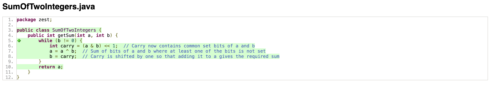
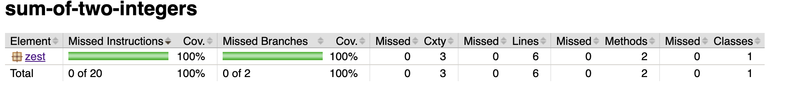

# SumofTwoIntegers
The following description of the task is given: 
Calculate the sum of two integers a and b, but you are not allowed to use the operators + and  -.

## Task 1
The first two tests implemented were the examples provided in the README. With these two tests, we already achieve 100% line coverage.

## Task 2
**pre-condition**:
The sum of the input integers a and b does not overflow the 32-bit signed integer range.

**post-condition**:
After executing the method the returned value should be the correct sum of input integers a and b.

**invariant**:
The current value of a correctly reflects the sum of its initial value and the changes made to b during the loop.

## Task 3
To check for pre-condition violation the two 'testPreConditionViolation' tests were added. One where the sum of a and b overflows and one where it underflows.
We also added a test for two negative inputs and two tests which test bordercases at Integer.MIN_VALUE and Integer.MAX_VALUE. With these additions to the test suite we can also ensure that the post-condition holds after the execution under various conditions and that the invariant is maintained. 

## Task 4

One property which should always hold for addition is **commutativity**. This means the order of operands should not affect the result.

Another property that should hold is the **identity** property of addition: when adding zero to any number, the result should be the same number

Adding a number to its **negation** should always result in zero. This property should also always hold for this example.

And finally the **associative** property: When we add three numbers, the association of numbers in a different pattern does not change the result.

These four properties were included in the test suite using the @Property annotation. Due to jqwik testing numerous values, including border cases, we had to add input constraints to avoid violating the pre-condition. Only the identity property inputs do not need to be restricted because this test cannot violate the pre-condition.