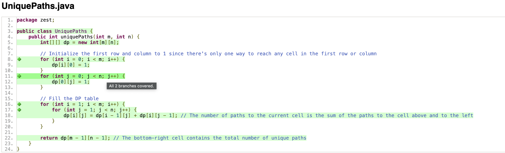
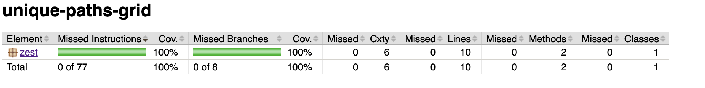

# UniquePaths
The following description is given: A robot is located in the top-left corner of a m x n grid. The robot can only move either down or right at any point in time. The robot is trying to reach the bottom-right corner of the grid. How many possible unique paths are there?

## Task 1
By adding the given examples to the testsuite we achieve 100% line coverage:

## Task 2
**pre-condition**: Input values m and n are in the range [1, 100].

**post-condition**: The final value returned by the function is non-negative.

**invariant**: For any cell in the grid, the value of that cell represents the unique paths to reach that cell from the top left corner using only downward or rightward moves.

## Task 3
The three example tests which already have been implemented validate normal operation when the pre-condition is met. To test if appropriate errors are thrown when the pre-condition is violated we added two tests 'preConditionViolated'. Two more edge case tests were added which test the minimum size grid and the maximum size grid. This way we found out that the resulting value overflows for 32-bit signed integers for large grids. This caused the values to become negative and violate the post-condition. To prevent this problem we changed the type of the dp and the type of the returned value to BigInteger. Another possible way to solve this would be to add some kind of check that just returns Integer.MAX_VALUE when it is reached.

## Task 4
One property which should always hold for this problem is that the result should not change when swapping m and n. To test this we added the testSymmetry Property test.

Another property which must hold is consistency. This means that the results for the same input values m and n should not change. See the testConsistency Property test.

To ensure that property testing works, we limited the input range by using @Provide with arbitrary integers in the range [1, 100]. Since we already changed the type of dp and the returned value to BigInteger, the property tests passed without failing. Without changing the types, the tests would have violated the post-condition and we would have come to the same conclusion as in task 3.
