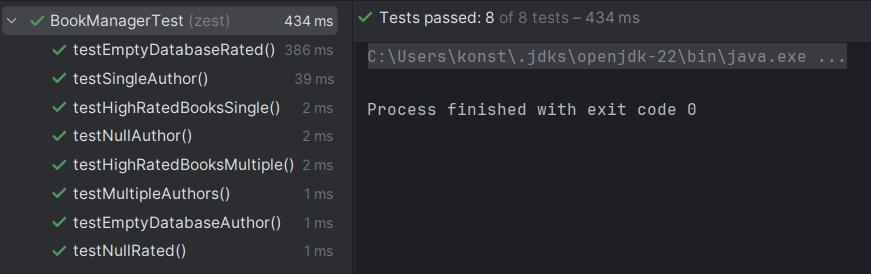

# Book Reviews

### A)
My Mocked fetcher in the "testMultipleAuthors" test returns three books \
-book_rated_5 is the "In point" \
-book_rated_4 is the "On point" \
-book_rated_3 is the "Off point"

#### 1)
The two external dependencies are the DatabaseConnection and BookRatingsFetcher classes.
I think we should focus on the BookManager class and therefore we could use a stub for the BookRatingsFetcher.
Consequently, a DatabaseConnection double wont be needed because we stub the BookRatingsFetcher anyways.
Using a real database and actually fetching information form the database would be rather complicated and slow.
#### 2)
This is a classic case where we should perform dependency injection for flexibility. We inject the BookRatingsFetcher 
into the BookManager object by adding it to the constructor of the class.
#### 3)
Using mocks makes the tests less realistic. Using a stub for the BookRatingsFetcher will not test the actual interaction
of the Bookmanager with the Database. Also, there is an increased coupling between the code and the test. If we were to 
change the code of our Classes we will probabbly also have to change our test.

### B)
#### 1)
The two external dependencies are also the DatabaseConnection and BookRatingsFetcher.
#### 2)
I added a class variable "Author" to the book class as it is needed for the uniqueAuthors method.
Because I changed the BookManager in Part "A" so that the BookRatingsFetcher is injected I did not have to change further things.
#### 3)
Because I changed the book class I also had to change the other tests where I created books as these did not have
an author yet.

All tests pass:

## ChatGPT prompts
-Help me add AssertJ to my pom.xml file \
-How can I extract every title from the Books using AssertJ? --> extracting(Book::getTitle)