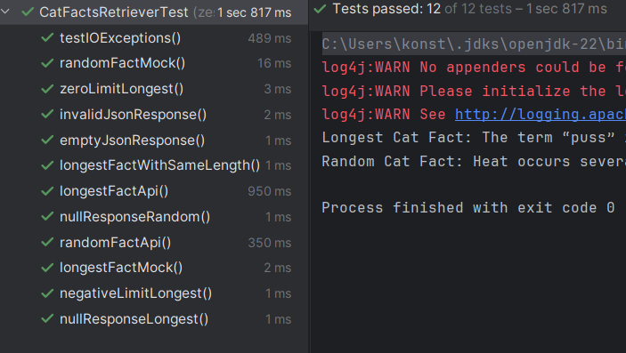

# Cat Facts

### A)
#### 1)
The two external dependencies are the http client class and the CatFactsReceiver. We want to test the CatFactsRetriever
so it does not make sense to use a double for the retriever. However, we can mock the HttpUtil class to return
predefined cat facts instead of actually making API calls. This will make the tests faster and the CatFactsRetriever class
is isolated from the API so we can test various responses. 
#### 2)
This is again a case where we should perform dependency injection for flexibility. We inject a HttpUtil object
into the CatFactsRetriever by adding it to the constructor of the class. However, the HttpUtil class currently is a 
utility class with a static method. Consequently, we first have to refactor the HttpUtil class to allow instances rather than static usage.
Then I add HttpUtil to the constructor and test with randomFactTest and longestFactTest if the dependency injection works as expected.
Also, I found that when passing negative limits to retrieveLongest there is no IllegalArgumentException so I added this check to the method. 
#### 3)
Using mocks makes the tests less realistic. Using a double for HttpUtil will not test the actual interaction
of the CatFactsReceiver with the API. So there could still be some comparability issues with the API. Also, there is an increased coupling between
the code and the test. If we were to change the code of our Classes we will probabbly also have to change our test.

All tests pass:

## ChatGPT prompts
-What will my json format have to look like for testing?
-How can I test if a nullpointer exception is thrown for a method with and without a parameter?