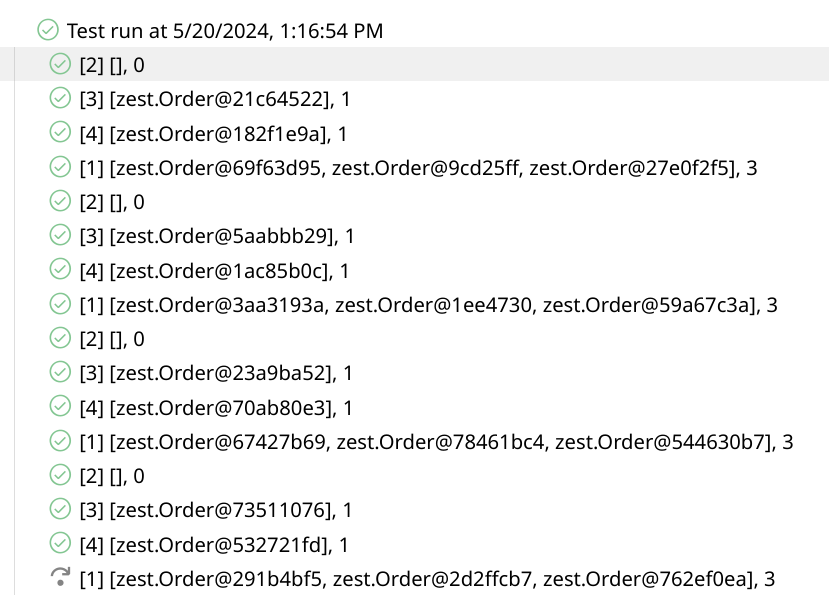

# Documentation e-shop testing

## Exercise

### A. Number of invocations
*First, test whether the `onOrderPlaced` method is called as many times as it should.*

For this task, I decided to use a parametrized test with some example values in different partitions for the Order array:

- A normal Order array with three Orders, non-empty IDs, and non-empty amount
- An empty array of Orders
- An array with one Order, with empty ID string and amount 2 --> expected behavior not specified
- An array with one Order, non-empty ID string but amount 0 --> expected behavior not specified

### B. Content of invocations—`ArgumentCaptor`
*Counting the number of invocations may not be enough; additionally, test whether the contents of the order are as expected. Use `ArgumentCaptor` to do this.*

I decided to reuse the parametrized for the earlier test for this test, except for the list with three Orders to keep the test as simple as possible. I think this is ok because this test does not focus on the number of calls, but the content of the orders.

### C. Content of invocations—Increasing observability
*Instead of using `ArgumentCaptor`, you could increase the observability of one or more classes to achieve the same goal.
Implement the necessary code for increasing the observability and write additional test(s) to test whether the content of the messages is as expected.*

I do not really see the point of making `EventPublisher.publishOrderToAllListeners` return the same Order it got as parameter to make assertions on it, because it does not tell us if the listeners received the Orders correctly. On the other hand, having listeners return the Order if successful would require expensive setup and cleaning of test databases and emails, but it would definitely increase the realism of the tests.

I will therefore change the `EventListener` interface and its implementations to return the passed Order if the operations concerning the API were successful (e.g. no exceptions raised). The `EventPublisher` will return false if one of the returned Orders is not equal to the passed Order. I will then write tests based on this new interface, using the same parameters as before. 

### D. Comparison
*What are the advantages and what are the disadvantages of the techniques you used in B. and C.?*

Having listeners return the Order if successful would require expensive setup and cleaning of test databases and emails in a real implementation, but it definitely increases the realism of the tests. On the other hand, I had to change code in a lot of places and increase the complexity of `EventPublisher.publishOrderToAllListeners` to handle the new observability features, although the complexity of the tests decreased a bit. Using mocks is for sure much simpler, albeit less realistic.

## Test results

The detailed results can be analyzed in [the log](./assets/tests_results_details.txt).

## LLM Questions

### Q1

**junit skip a test given a specific parameter**

To conditionally skip a test in JUnit based on a specific parameter, you can use JUnit's assumption mechanism. Assumptions allow you to skip tests when certain conditions are not met. If an assumption fails, the test is aborted, which effectively skips the test for that specific condition.

Here’s how you can use Assume from the org.junit.jupiter.api.Assumptions class to conditionally skip tests in a parameterized test: [...]