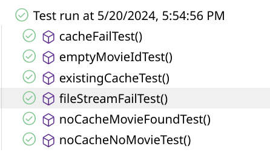

# Movie Streaming Service Testing Documentation

## Tests

### MovieStreamingManagerTest

I see the following test cases:

| Case | Expected behavior | Expected output |
| --- | --- | --- |
| empty movieID string | mockCacheService returns null, fileStreamServiceMock returns null | null |
| movieID with existing cache | mockCacheService returns details, fileStreamServiceMock not called | cached movie details |
| movieID without cache, no movie found | mockCacheService returns null, fileStreamServiceMock returns null | null |
| movieID without cache, movie found | fileStreamServiceMock returns MovieMetadata and streamToken, mockCacheService caches details | retrieved movie details |
| CacheService fails | mockCacheService throws Exception after theoretical timeout | Exception |
| FileStreamService fails | fileStreamServiceMock throws Exception after theoretical timeout | Exception |

I implemented these test cases with JUnit and Mockito.

## Bugs

| Case | Expected output | Actual output | Fix |
| --- | --- | --- | --- |
| empty movieID string | null | Garbage details | return null when fileStreamService.retrieveMovie returns null |

I did not manage to implement the last two cases in time, but I expect that the tests would fail. MovieStreamingManager is missing a try/catch statement to handle Exceptions coming from the external services.

## Results

## LLM Queries

**can a mock raise an exception and is it a good idea?**

Yes, a mock can be configured to throw an exception using Mockito. This is often done to test how your code handles exceptional conditions, such as when a dependency fails or returns an error. It is a good practice to test these scenarios to ensure your application can handle errors gracefully and maintain stability.

Configuring a Mock to Throw an Exception

You can configure a mock to throw an exception using the thenThrow method in Mockito. Here is a simple example: [...]

**Is it a good idea to instantiate mocks and the class under test in the test class scope, or is it better to instantiate them fresh with a @BeforeEach ?**

When writing unit tests with Mockito, you have the choice of instantiating mocks and the class under test at the test class scope (as instance variables) or freshly within a @BeforeEach setup method. Both approaches have their use cases, but generally, it's considered better practice to instantiate them fresh within a @BeforeEach method. Here's why:
Benefits of Using @BeforeEach for Instantiation

    Isolation and Independence: Each test method gets a fresh instance of the mocks and the class under test. This ensures that tests are isolated from each other and that the state is reset between tests, reducing the risk of unintended side effects.

    Test Clarity: It makes the setup process more explicit. Each test method can assume that it starts with a clean slate, which can make the tests easier to understand and maintain.

    Consistency: If you add or modify setup code, doing it in @BeforeEach ensures all tests automatically use the updated setup, reducing the risk of inconsistencies.

    Avoiding Shared State: By avoiding shared state between tests, you reduce the chances of one test affecting another, leading to more reliable and predictable tests.

Example: Instantiation in @BeforeEach [...]