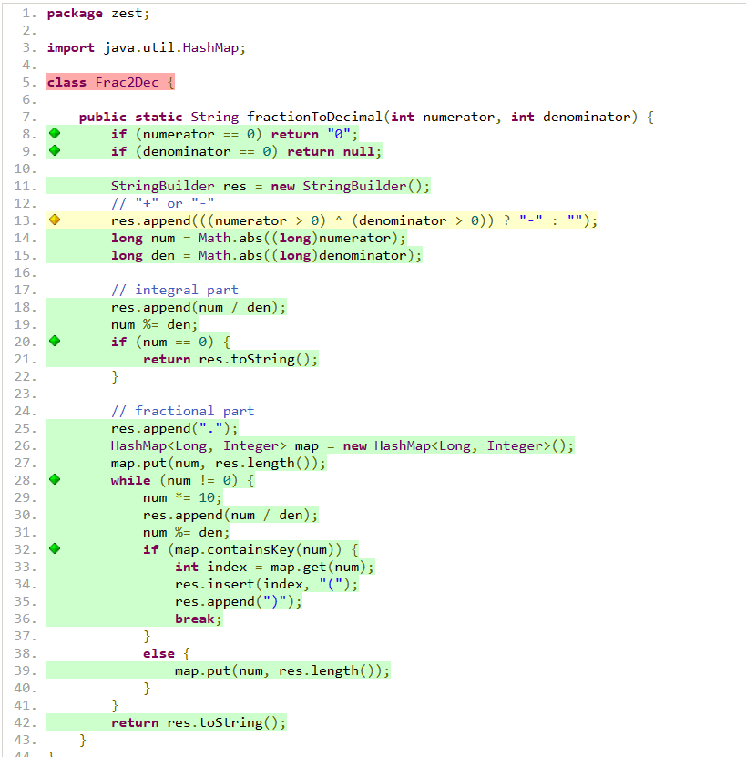

# GenerateParentheses

### Specification testing

#### 1. Understanding the requirements
Its also straight forward. Convert a fraction into a string format. And if theres a repeating part it should be enclosed.
#### 2. Exploring the program
I realized there are different scenarios: positive and negative fractions, zero numerator, non-repeating, and repeating decimals.
#### 3. Analyze properties of inputs and outputs and find partitions
Inputs:
Positive and negative values for numerator and denominator.
Zero numerator.
Denominator as zero (invalid scenario).
Fractions resulting in finite decimals.
Fractions resulting in repeating decimals.

Outputs:
A string of a non-repeating decimal.
A string of a of a repeating decimal with parentheses around the repeating part.
"0" if the numerator is zero.
null if the denominator is zero.
#### 4. Analyze the boundaries
going from non-repeating to repeating decimals (e.g., 1/2 vs. 1/3).
Small fractions vs. large ones.

#### 5. Devise test cases
I added this line to return null if theres a division by zero
        if (denominator == 0) return null;
#### 6. Implement the automated test cases

#### 7. Use creativity and experience to enhance the test suite

### Structural testing
I only missed the class initialization which is not a problem
And only one branch on line 13

### Mutation testing
- Statistics
  ================================================================================
>> Line Coverage: 24/25 (96%)
>> Generated 20 mutations Killed 18 (90%)
>> Mutations with no coverage 0. Test strength 90%
>> Ran 22 tests (1.1 tests per mutation)

## ChatGPT prompts
- can you help me find missing properties inputs and outputs